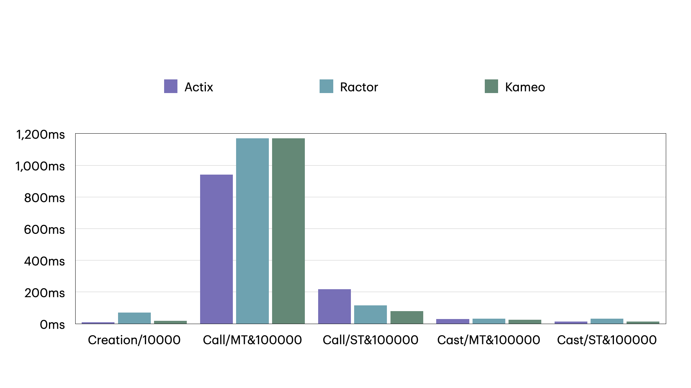

# rust-actors-benches

## Preconditions

- CPU: 3.1 GHz Quad-Core Intel Core i7
- Memory: 16 GB 2133 MHz LPDDR3
- MacOS: 13.6.5
- Rust: 1.81
- Actix: 0.13.5
- Ractor: 0.11.1
- Kameo: 0.10.0

## cargo bench --bench [actix](https://github.com/actix/actix)

- Creation of 100 actors time: **51.671 µs**
- Creation of 10000 actors time: **10.423 ms**
- Waiting on 100000 messages to be processed [ by **single-threaded + do_send** ] time: **14.529 ms**
- Waiting on 100000 messages to be processed [ by **multi-threaded + do_send** ] time: **29.625 ms**
- Waiting on 100000 messages to be processed [ by **single-threaded + send** ] time: **229.12 ms**
- Waiting on 100000 messages to be processed [ by **multi-threaded + send** ] time: **922.30 ms**

## cargo bench --bench [ractor](https://github.com/slawlor/ractor)

- Creation of 100 actors time: **973.40 µs**
- Creation of 10000 actors time: **88.813 ms**
- Waiting on 100000 messages to be processed [ by **single-threaded + cast** ] time: **41.151 ms**
- Waiting on 100000 messages to be processed [ by **multi-threaded + cast** ] time: **37.146 ms**
- Waiting on 100000 messages to be processed [ by **single-threaded + call** ] time: **129.63 ms**
- Waiting on 100000 messages to be processed [ by **multi-threaded + call** ] time: **1.1816 s**

## cargo bench --bench [kameo](https://github.com/tqwewe/kameo)

- Creation of 100 actors time: **182.82 µs**
- Creation of 10000 actors time: **32.876 ms**
- Waiting on 100000 messages to be processed [ by **single-threaded + tell** ] time: **25.228 ms**
- Waiting on 100000 messages to be processed [ by **multi-threaded + tell** ] time: **32.182 ms**
- Waiting on 100000 messages to be processed [ by **single-threaded + ask** ] time: **98.135 ms**
- Waiting on 100000 messages to be processed [ by **multi-threaded + ask** ] time: **1.1727 s**

## Comparison

